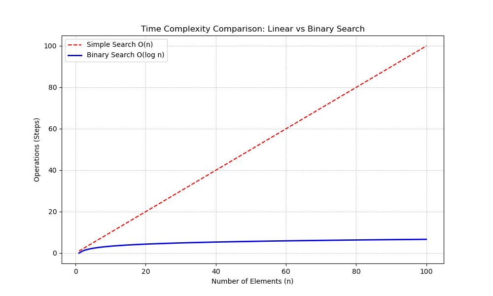

# 📚 Grokking Algorithms (Study Notes)

> Implementations, visual analysis, and unit tests based on the book *"Grokking Algorithms"* by Aditya Bhargava.

This repository documents my journey mastering algorithms and data structures. Unlike standard repos, this project focuses on **Data-Driven Analysis**—visualizing time complexity ($) to understand performance at scale.

## 🛠️ Tech Stack & Workflow
- **Language:** Python 3.11+
- **Environment:** Nix (Flakes) + uv
- **Testing:** Pytest
- **Analysis:** Matplotlib, NumPy

## 🚀 Progress & Complexity Analysis

| Chapter | Algorithm | Time Complexity | Space Complexity | Status |
| :--- | :--- | :--- | :--- | :--- |
| **01** | Binary Search | (\log n)$ | (1)$ | ✅ Completed |
| **02** | Selection Sort | (n^2)$ | (1)$ | ⬜ Pending |
| **03** | Recursion | - | (n)$ (Stack) | ⬜ Pending |
| **04** | Quicksort | (n \log n)$ | (\log n)$ | ⬜ Pending |
| **05** | Hash Tables | (1)$ | (n)$ | ⬜ Pending |
| **06** | Breadth-First Search | (V+E)$ | (V)$ | ⬜ Pending |
| **07** | Dijkstra's Algorithm | (E \log V)$ | (V)$ | ⬜ Pending |
| **08** | Greedy Algorithms | *Varies* | *Varies* | ⬜ Pending |
| **09** | Dynamic Programming | *Varies* | *Varies* | ⬜ Pending |
| **10** | K-Nearest Neighbors | (n)$ | (n)$ | ⬜ Pending |

## 📊 Visualizations

### Chapter 01: Binary Search vs Simple Search
Comparison showing the logarithmic efficiency of Binary Search against Linear Search.



## 🧪 How to Run

This project uses **Nix** for a reproducible environment.

1. **Enter the environment:**
   ```bash
   nix develop
   ```

2. **Run Unit Tests:**
   ```bash
   pytest
   ```

3. **Run a specific algorithm:**
   ```bash
   python src/ch01_intro/binary_search.py
   ```

---
*Created by [Pedro Brantes](https://github.com/pedrobrantes)*
